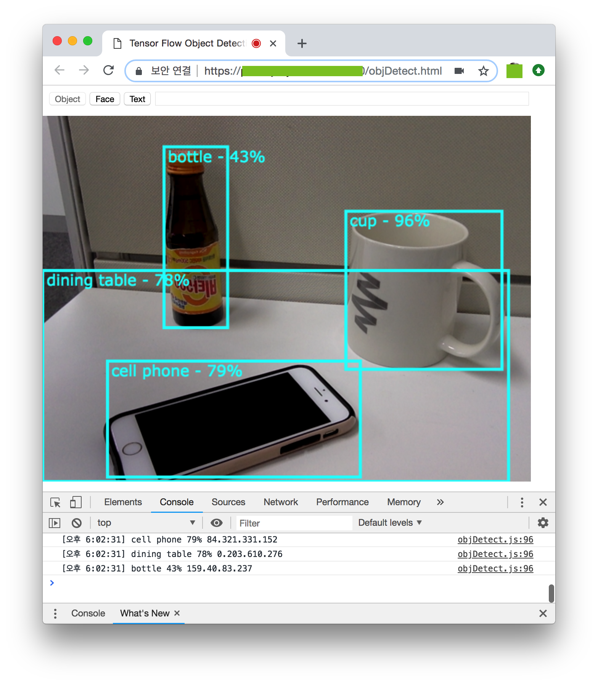
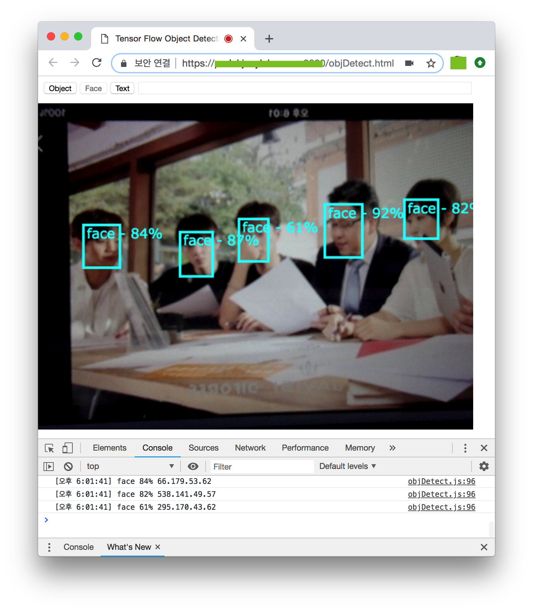
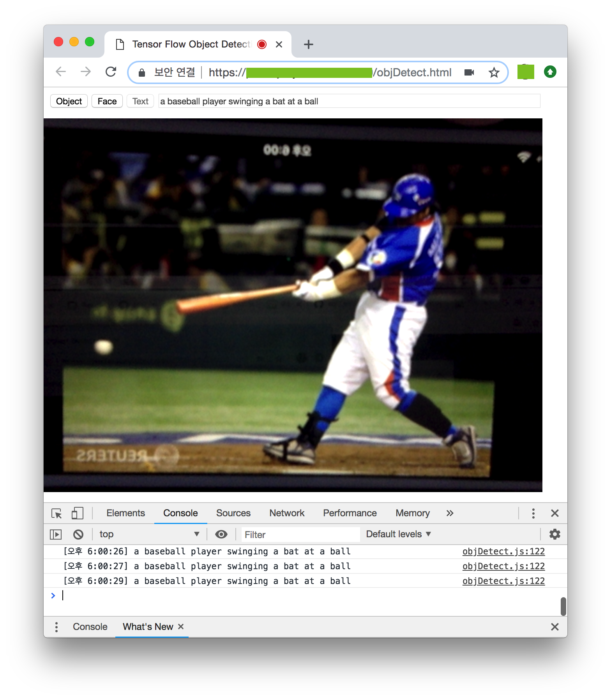

# webrtc-tensorflow
Using Flask to serve a tensorflow models as a RESTful webservice

Please see the [Computer Vision on the Web with WebRTC and TensorFlow](https://webrtchacks.com/webrtc-cv-tensorflow/) for a walkthrough and more details.

## Models
* [Tensorflow Object Detection API](https://github.com/tensorflow/models/tree/master/research/object_detection): localizing and identifying multiple objects in a single image.
* [Tensorflow Face Detector](https://github.com/yeephycho/tensorflow-face-detection): A mobilenet SSD(single shot multibox detector) based face detector.
* [Show and Tell: A Neural Image Caption Generator](https://github.com/tensorflow/models/tree/master/research/im2txt): image-to-text neural network for image captioning.

## Initialize Flask REST API and Flask server
```python
import object_detection_api
import face_detection_api
import im2txt_api
from PIL import Image
from flask import Flask, request, Response

app = Flask(__name__)

@app.route('/im2txt', methods=['POST'])
def im2txt():
    try:
        image_file = request.files['image']
        objects = im2txt_api.get_captions(image_file.read())
        return objects

    except Exception as e:
        print('POST /im2txt error: %e' % e)
        return e

@app.route('/facedtt', methods=['POST'])
def facedtt():
    try:
        image_file = request.files['image']
        threshold = request.form.get('threshold')
        if threshold is None:
            threshold = 0.5
        else:
            threshold = float(threshold)

        image_object = Image.open(image_file)
        objects = face_detection_api.get_objects(image_object, threshold)
        return objects

    except Exception as e:
        print('POST /facedtt error: %e' % e)
        return e

@app.route('/objdtt', methods=['POST'])
def objdtt():
    try:
        image_file = request.files['image']  # get the image

        # Set an image confidence threshold value to limit returned data
        threshold = request.form.get('threshold')
        if threshold is None:
            threshold = 0.5
        else:
            threshold = float(threshold)

        # finally run the image through tensor flow object detection`
        image_object = Image.open(image_file)
        objects = object_detection_api.get_objects(image_object, threshold)
        return objects

    except Exception as e:
        print('POST /objdtt error: %e' % e)
        return e

if __name__ == '__main__':
    #app.run(debug=True, host='0.0.0.0', port=8080) # without SSL
    app.run(debug=True, host='0.0.0.0', port=8443, ssl_context=('/etc/ssl/server.cert', '/etc/ssl/server.key')) # with SSL
```





